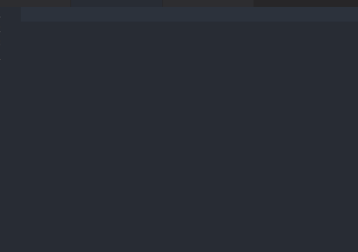
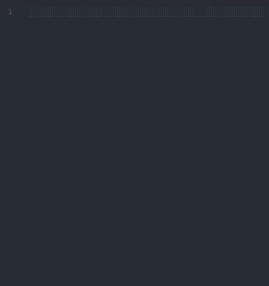

# VueHelper
-------------------
 


## 特点
- （1）可能是目前vscode最好的vue代码提示插件，不仅包括了vue2所有api，还含有vue-router2和vuex2的代码提示
```JavaScript
//todo:随着自己今后的学习中，计划增加element-ui和vux等一些vue流行组件库的代码提示
```
- （2）每个提示都有详细的中文描述，主要是方便学习，因为在学习的时候忘记某个api的用法，经常要查阅文档，比较浪费时间，所以我将每个代码提示都增加了描述，描述的依据都来源于官方中文文档
    - [vue中文官方文档](http://cn.vuejs.org/) | [vue-router中文官方文档](https://router.vuejs.org/zh-cn/) |  [vuex中文官方文档](https://vuex.vuejs.org/zh-cn/)


- （3）vue文件代码高亮fork自[vuter](https://github.com/octref/vetur)

## 代码提示
- 下面的代码提示只是展示部分，主要是是太多了，一个一个罗列出来比较麻烦。基本官方文档出现的api都做了代码提示，大家可以尝试，如果有疏漏的可以提issues
- 在vue和vue-router，vuex中一般"$"打头的都是实例api，在vscode编写代码提示片段中‘$’是变量，当你输入$是没作用的（可以参考vscode中jquery代码提示插件），所以对于所有"$"的请输入“vm”
- 对于提示的方式很多插件是使用简写形式，比如router对象的方法输入`rtb->`会提示`"router.beforeEach()`,这样虽然简便，但是需要强迫你去记忆，并不方便。所以我采取的是当你输入`router`的时候，会罗列所有关于`router`对象的属性和方法。如下图


### Vue代码提示(部分)



| Trigger  | Content |
| -------: | ------- |
| `V→`   | vue组件通用模板 （注意输入大写的“v”）|
| `VueConfigSilent`   |  `Vue.config.silent = ${true}` |
| `optionMergeStrategies`   |  `Vue.config.optionMergeStrategies` |
| `VueConfigErrorHandler`   | `Vue.config.errorHandler = function (err, vm) {\n\t${// handle error}\n}` |
| `ignoredElements`   |  `Vue.config.ignoredElements =[$0]` |
| `vm$set`   | `\\$set(${object}, ${key}, ${value});` |
| `vm$on`   |  `\\$on('${event}', ${callback})` |
| `v-if`   |  `v-if=\"${condition}\"` |
| `v-show`   | `v-show=\"${condition}\"` |
| `v-for`   |  `v-for=\"(${item},index) in ${items}\"` |

### vue-router代码提示（部分）


| Trigger  | Content |
| -------: | ------- |
| `VR`   | vue-router主文件模板（注意输入大写的‘VR’） |
| `path`   |  `{ path: '$1', component:${2:component} }` |
| `pathAsync`   | `{ path: '$1', name:'$2', component: resolve => require(['$3'], resolve) }` |
| `scrollBehavior`   | `scrollBehavior (to, from, savedPosition){\n\t//return 期望滚动到哪个的位置\n\t$0\n}` |
| `router.push`   | `router.push(${path}` |
| `vm$route.params`   | `\\$route.params` |

### vuex代码提示（部分）


| Trigger  | Content |
| -------: | ------- |
| `VX`   | vuex主文件模板（注意输入大写“vx”） |
| `mutations`   | `mutations: {\n\t$0\n}` |
| `store.commit`   | `store.commit('${action}',${payload})` |
| `store.dispatch`  |  `store.dispatch('${action}',${payload})` |
| `mapState`   | `mapState(${1:[]|{\\}})` |
| `mapGetters`   |  `mapGetters(${1:[]|{\\}})` |
| `vm$store`   | `\\$store` |

## 安装

* [vscode插件地址]()
```javascript
ext install VueHelper
```

## 改进

- 这个插件的代码提示会与官方文档同步（根据文档新增或者删除某个api的时候更新），如果有某个api没有提示可以提issues，另外有什么建议也欢迎提issues
- 这个插件主要是方便自己学习vue，所以很多提示是根据自己的代码风格，比如vue组件模板和vue-router，vuex主文件模板。仅供参考
- 如果发现生成的提示代码有错误，请提issues，或者pr
- 如果你想要自己的编写风格，请fork一份自行修改使用，可以在issues提建议一起讨论，我这提供就算是基础模板吧
- 如果该插件对你有帮助，不妨给个star

## 源码
[github](https://github.com/OYsun/vscode-VueHelper)
----------------------------------------------------------------------------------------------------------------------------

### 2016/12/22
- fist repo

