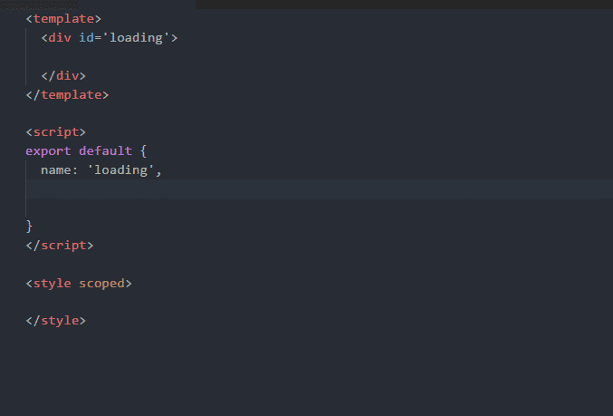
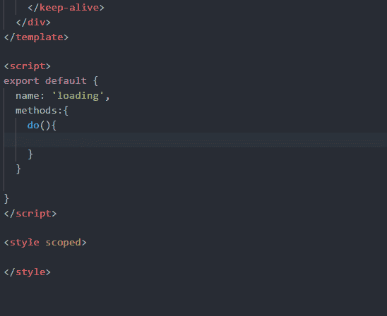
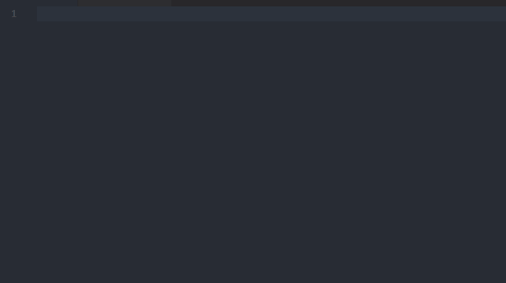
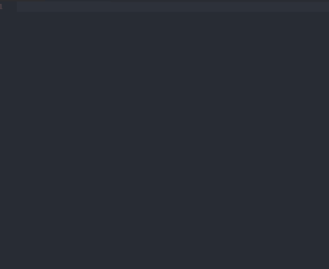
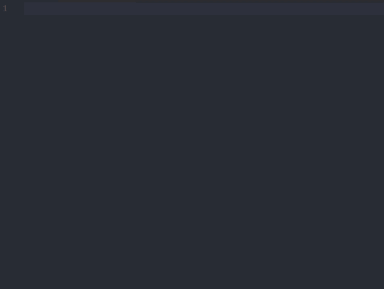
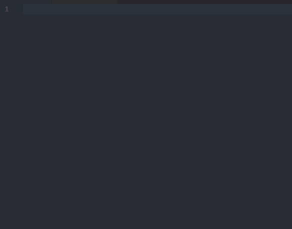

# VueHelper

 

## note

- master为英文描述版本，需要中文版本的请切换 [VueHelper-zh](https://github.com/OYsun/vscode-VueHelper/tree/VueHelper-zh)分支，注意在vscode扩展市场上的是英文描述版本
- 版本更新详情请浏览[releases](https://github.com/OYsun/vscode-VueHelper/releases)
- 关于文件配置问题，请参考这个[issue](https://github.com/OYsun/vscode-VueHelper/issues/1)

## feature
- （1）may be the best vue code snippets plug-ins in Vscode, not only includes the vue2 all api, also contains vue-router 2 and vuex 2 code </br> 可能是目前vscode最好的vue代码提示插件，不仅包括了vue2所有api，还含有vue-router2和vuex2的代码提示
```JavaScript
//todo:Plans to increase element-ui and vux and some other popular Vue component library code tips
```
- （2）Each snippet has a detailed description, mainly to facilitate learning, because when learning to forget the use of an api, often to consult the document will be a waste of time, so I will increase the description of each code snippet, description of the basis are derived from official documents </br>每个提示都有详细的描述，主要是方便学习，因为在学习的时候忘记某个api的用法，经常要查阅文档，比较浪费时间，所以我将每个代码提示都增加了描述，描述的依据都来源于官方文档
    - [vue](http://cn.vuejs.org/) | [vue-router](https://router.vuejs.org/zh-cn/) |  [vuex](https://vuex.vuejs.org/zh-cn/)


- （3）vue Syntax highlighting based on [vuter](https://github.com/octref/vetur) </br> vue文件代码高亮参考[vuter](https://github.com/octref/vetur)

## snippets
- The following code snippets shows only part of the show, as too many, one by one out more trouble.The basic official documents api have done a code hint, you can try, if there are omissions can submit issue </br> 下面的代码提示只是展示部分，主要是是太多了，一个一个罗列出来比较麻烦。基本官方文档出现的api都做了代码提示，大家可以尝试，如果有疏漏的可以提issues

- In vue and vue-router, vuex general `$` are the beginning of the vm api,In the vscode code snippet prepared by the `$` is a variable, when you enter $ is no role。So for all "$" please enter `vm` </br> 在vue和vue-router，vuex中一般"$"打头的都是实例api，在vscode编写代码提示片段中‘$’是变量，当你输入$是没作用的（可以参考vscode中jquery代码提示插件），所以对于所有"$"的请输入“vm”



- Tips for the way Many plug-ins is to use shorthand，for example, the router object method, enter `rtb->` will prompt `router.beforeEach()`,This is convenient, but need to force you to remember, not friendly.So what I've taken is that when you type `router`, it lists all the properties and methods of the router object </br>对于提示的方式很多插件是使用简写形式，比如router对象的方法输入`rtb->`会提示`"router.beforeEach()`,这样虽然简便，但是需要强迫你去记忆，并不友好。所以我采取的是当你输入`router`的时候，会罗列所有关于`router`对象的属性和方法。



### Vue code snippets



| Trigger  | Content |
| -------: | ------- |
| `V→`   | V-templates |
| `VueConfigSilent`   |  `Vue.config.silent = ${true}` |
| `optionMergeStrategies`   |  `Vue.config.optionMergeStrategies` |
| `VueConfigErrorHandler`   | `Vue.config.errorHandler = function (err, vm) {\n\t${// handle error}\n}` |
| `ignoredElements`   |  `Vue.config.ignoredElements =[$0]` |
| `vm$set`   | `${this}.\\$set(${object}, ${key}, ${value});` |
| `vm$on`   |  `${this}.\\$on('${event}', ${callback})` |
| `v-if`   |  `v-if=\"${condition}\"` |
| `v-show`   | `v-show=\"${condition}\"` |
| `v-for`   |  `v-for=\"(${item},index) in ${items}\"` |

### vue-router code snippets



| Trigger  | Content |
| -------: | ------- |
| `VR`   | VueRouter master file template |
| `path`   |  `{ path: '$1', component:${2:component} }` |
| `pathAsync`   | `{ path: '$1', name:'$2', component: resolve => require(['$3'], resolve) }` |
| `scrollBehavior`   | `scrollBehavior (to, from, savedPosition){\n\t//return 期望滚动到哪个的位置\n\t$0\n}` |
| `router.push`   | `router.push(${path}` |
| `vm$route.params`   | `${this}.\\$route.params` |

### vuex code snippets



| Trigger  | Content |
| -------: | ------- |
| `VX`   | vuex master file template |
| `mutations`   | `mutations: {\n\t$0\n}` |
| `store.commit`   | `store.commit('${action}',${payload})` |
| `store.dispatch`  |  `store.dispatch('${action}',${payload})` |
| `mapState`   | `mapState(${1:[]|{\\}})` |
| `mapGetters`   |  `mapGetters(${1:[]|{\\}})` |
| `vm$store`   | `${this}.\\$store` |

## Installation

* [vscode Extensions Marketplace](https://marketplace.visualstudio.com/items?itemName=oysun.vuehelper)
```javascript
ext install VueHelper
```

## Contributing
This is an open source project open to anyone. Contributions are extremely welcome :[github](https://github.com/OYsun/vscode-VueHelper) 

## Release Notes

### More versions of the information, please click [here](https://github.com/OYsun/vscode-VueHelper/releases) </br>关于版本更新的更多细节，请点击[这里](https://github.com/OYsun/vscode-VueHelper/releases)


